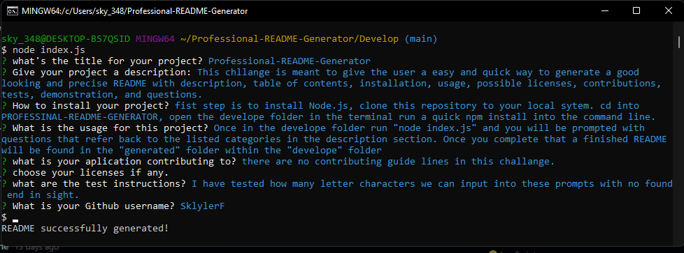

  
# Professional-README-Generator

## Description
This chllange is meant to give the user a easy and quick way to generate a good looking and precise README with description, table of contents, installation, usage, possible licenses, contributions, tests, demonstration, and questions.

## Table of Contents
* [Installation](#installation)
* [Usage](#usage)
* [Licenses](#licenses)
* [Contribution](#contribution)
* [Tests](#tests)
* [Questions](#questions)

## Installation
fist step is to install Node.js, clone this repository to your local sytem. cd into PROFESSINAL-README-GENERATOR, open the develope folder in the terminal run a quick npm install into the command line.  

## Usage
Once in the develope folder run "node index.js" and you will be prompted with questions that refer back to the listed categories in the description section. Once you complete that a finished README will be found in the "generated" folder within the "develope" folder 

## Licenses
This project falls under the following license(s): 

## Contribution
there are no contributing guide lines in this challange. 

## Tests
I have tested how many letter characters we can input into these prompts with no found end in sight.

## Questions
If you have any questions, please contact me below: 

## Demonstration
   

   link to video demonstration https://drive.google.com/file/d/1inyKd5CezW_nywB2ZU92jLC0l0rAVikQ/view

Github: [SklylerF](https://github.com/SklylerF) 

Email: sky_3489@icloud.com

